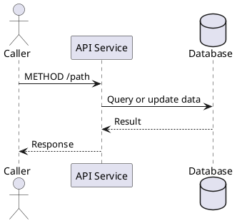

# API Spec Reference

Use this reference for HTTP APIs, callbacks, webhooks, and internal service endpoints.

## Page Shape

Use this order unless the user supplies a stronger local standard:

1. Overview
2. Change Log
3. Sequence Diagram
4. Request
5. Response
6. Error Handling
7. Assumptions and Open Questions

For compact specs, keep `Error Handling` under `Response`. For detailed specs, keep it as a top-level section.

## Title

Use a title that identifies intent and endpoint:

```text
<Action or Capability> - <METHOD> <path> [version/release]
```

Examples:

```text
Create Order - POST /orders
Get Customer Profile - GET /customers/{customer_id}/profile
Payment Status Callback - POST /callbacks/payments/status
```

Avoid status tags such as `[Deprecated]`, `[Removed]`, or `[Not Used]` unless the spec is explicitly documenting a deprecated endpoint.

## Overview

Include a one-row or short table:

| Field | Value |
| --- | --- |
| Purpose | What business or technical outcome this endpoint provides. |
| API Layer | BFF, orchestration, core, adaptor, callback, middleware, or unknown. |
| Method | HTTP method. |
| Path | Endpoint path. |
| Consumers | Client, service, partner, or internal caller. |
| Dependencies | Downstream services, database tables, queues, files, or external systems. |
| Authentication | Auth mechanism or `TBD`. |

## Change Log

Use:

| Date | Updated By | Description | Status |
| --- | --- | --- | --- |
| YYYY-MM-DD | Name/team | Initial draft | Draft |

Use `Draft`, `Ready for Review`, `Approved`, `Deprecated`, or `Removed` consistently.

## Sequence Diagram

Prefer PlantUML when the output format supports it:



The sequence must match the schema and dependency sections. Do not show a downstream call that is not listed in dependencies.

## Request

Include these subsections when applicable:

- Endpoint
- Headers
- Path Parameters
- Query Parameters
- Request Body Schema
- Sample Request

Schema table:

| Field | Type | Mandatory | Description | Remark |
| --- | --- | --- | --- | --- |
| `field_name` | string | Y | Meaning and validation rule. | Example: `ABC123` |

Rules:

- Use `Y`/`N` for simple mandatory flags, or `M`/`O`/`C` when conditionality matters.
- Use dot notation for nested fields: `data.items[].id`.
- State format constraints in `Description` or `Remark`.
- Every sample field must appear in the schema.
- Every mandatory request field should appear in the sample unless the field is generated by infrastructure.

## Response

Include:

- Standard Response Code
- Response Schema
- Sample Response

Standard response code table:

| HTTP Code | Body Code | Scenario | Description |
| --- | --- | --- | --- |
| 200 OK | 1000 | Success | Request completed successfully. |
| 400 Bad Request | 4000 | Validation error | Request is invalid. |
| 401 Unauthorized | 4001 | Unauthorized | Authentication failed or is missing. |
| 404 Not Found | 4004 | Not found | Target resource or service was not found. |
| 500 Internal Server Error | N/A | Internal error | Unexpected server-side error. |

Response schema table:

| No. | Field | Type | Mandatory | Source | Description |
| --- | --- | --- | --- | --- | --- |
| 1 | `code` | integer | M | API | Business response code. |
| 2 | `message` | string | M | API | Human-readable response message. |
| 3 | `data` | object | O | API | Response payload. |

Rules:

- Response samples must be valid JSON when JSON is expected.
- Business codes in samples must match the standard response code table.
- If `data` can be null or omitted, state when.
- Include both success and representative failure samples for non-trivial APIs.

## Review Signals

Flag these issues:

- Method/path in title differs from endpoint section.
- Schema fields are missing type, mandatory flag, or description.
- Sample payload does not match schema.
- Response code table omits meaningful business failures.
- Sequence diagram contradicts dependencies or layer behavior.
- Authentication, authorization, idempotency, or timeout behavior is unclear.
- Deprecated/removed endpoints are not clearly marked.
