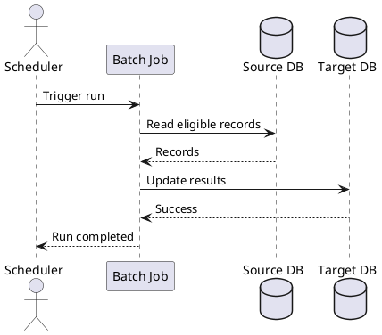

# Batch Job Spec Reference

Use this reference for scheduled jobs, manually-triggered jobs, data syncs, file transfers, cleanup jobs, reconciliation jobs, and retry jobs.

## Page Shape

Use this order unless the user supplies a stronger local standard:

1. Overview
2. Change Log
3. Schedule and Trigger
4. Sequence Diagram
5. Manual Run
6. Configuration
7. Field-to-Field Mapping
8. Error Handling and Retry
9. Monitoring and Operations
10. Related Documents
11. Assumptions and Open Questions

## Parent Summary

For a batch job index page, use:

| No. | Name | Severity | Frequency | Time | Service | Description | Report/File |
| --- | --- | --- | --- | --- | --- | --- | --- |
| 1 | batch-name | High/Medium/Low | Daily | HH:mm timezone | service-name | What the job does. | File/table/report or N/A |

Use `Severity`, not misspelled variants, unless preserving an existing page exactly.

## Overview

Include:

| Field | Value |
| --- | --- |
| Job Name | Batch or cron job name. |
| Purpose | Outcome of the job. |
| Owner | Team or service owner. |
| Runtime | Kubernetes CronJob, scheduler, manual command, worker, or external scheduler. |
| Inputs | Tables, files, API calls, topics, or parameters. |
| Outputs | Tables, files, API calls, topics, reports, or notifications. |
| Dependencies | Databases, external systems, queues, object storage, SFTP, or APIs. |

## Schedule And Trigger

Document both normal schedule and other triggers:

| Trigger Type | Value | Timezone | Description |
| --- | --- | --- | --- |
| Schedule | Cron expression or business schedule | Asia/Bangkok or specified timezone | Normal automatic run. |
| Manual | Command, API, pipeline, or UI action | N/A | How operators start it manually. |
| Event | Topic/file/API trigger | N/A | Event that starts the job. |

Rules:

- Always state timezone for schedules.
- State whether missed schedules are retried, skipped, or caught up.
- State concurrency policy: allow, forbid, replace, or unknown.
- State expected duration or timeout when known.

## Sequence Diagram

Show scheduler/operator, job, data sources, data targets, and external systems.

## Manual Run

Manual run is mandatory when the user asks for batch specs or when operations may need replay.

Include:

- Who is allowed to run it.
- Command, pipeline, API, or UI action.
- Required parameters and examples.
- Preconditions.
- Expected output or log signals.
- Rollback or cleanup instructions.

Example table:

| Parameter | Required | Example | Description |
| --- | --- | --- | --- |
| `business_date` | Y | `2026-01-31` | Business date to process. |
| `dry_run` | N | `true` | Validate without writing changes. |

## Configuration

Document config values without exposing secrets:

| Config Key | Required | Example | Description |
| --- | --- | --- | --- |
| `BATCH_TIMEOUT_SECONDS` | Y | `900` | Max runtime before timeout. |
| `SFTP_PASSWORD` | Y | `<secret>` | Stored in secret manager or runtime secret. |

Rules:

- Never include real passwords, API tokens, private keys, or production secrets.
- Use placeholders such as `<secret>`, `<from-secret-manager>`, or `<env-var>`.
- Include example insert SQL or config snippets only when they are safe and useful.

## Field-To-Field Mapping

Use for data transformation, file generation, DB updates, or API mapping:

| Input/Output | Target Field Name | Transformation | Source Field | Remarks |
| --- | --- | --- | --- | --- |
| Output | `target_field` | Trim and uppercase | `source.field` | Empty when source is null. |

Every write target should have a source or transformation rule. Mark generated values clearly.

## Error Handling And Retry

Document:

- Retryable vs non-retryable errors.
- Retry count, backoff, and timeout.
- Partial success behavior.
- Duplicate handling and idempotency key.
- Dead-letter, report, or manual reconciliation path.
- Alerting threshold.

## Review Signals

Flag these issues:

- Schedule lacks timezone.
- Trigger and manual run are missing or vague.
- Config examples include secrets.
- Sequence diagram omits a documented dependency.
- Field mapping lacks source fields or transformations.
- Retry behavior could duplicate updates.
- Monitoring and failure recovery are not actionable.
